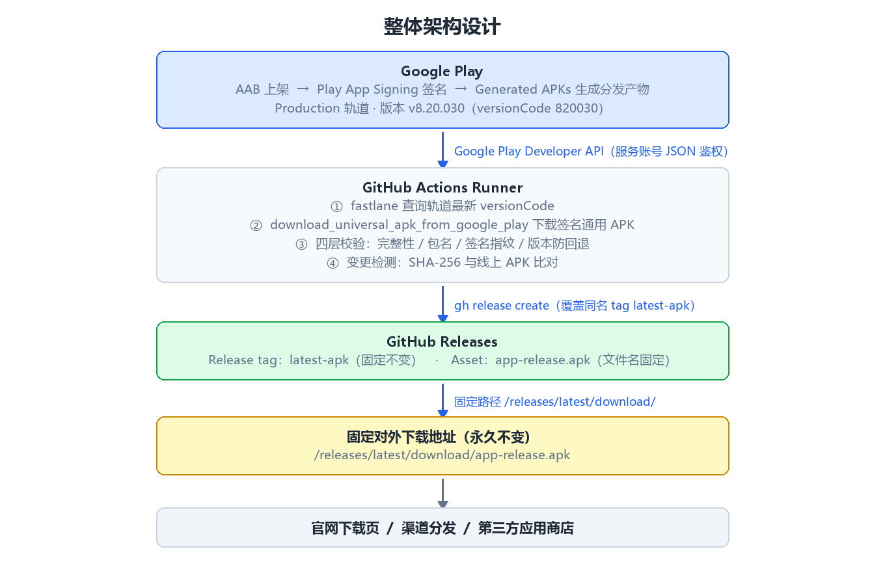
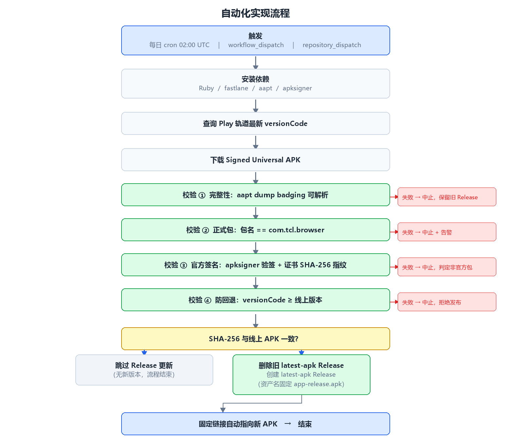

# browsehere-play-apk

自动从 Google Play 拉取**已签名的通用 APK（Signed Universal APK）**，经过多层校验后发布到 GitHub Releases，对外提供一个**永久不变、始终指向最新版**的下载地址。

当前应用：`com.tcl.browser`

## 固定下载地址

```
https://github.com/PuHuaKuang/browsehere-play-apk/releases/latest/download/app-release.apk
```

链接恒定不变，每次 Play 发新版后自动更新背后的 APK，可直接用于官网下载页、渠道分发或第三方应用商店上传。

## 工作原理



1. 通过 Google Play Developer API 查询 `production` 轨道最新 `versionCode`
2. 使用 fastlane 下载 Play 基于 AAB 生成的签名通用 APK（与 Play App Signing 同密钥）
3. 对 APK 执行四层校验
4. 与线上版本做 SHA-256 比对，有变化才覆盖更新 `latest-apk` Release



## 四层校验

| # | 校验项 | 手段 | 失败处理 |
|---|--------|------|----------|
| ① | 完整性 | `aapt dump badging` 可解析且含 versionCode | 中止，保留旧版本 |
| ② | 正式包 | 包名等于配置值 | 中止 + 告警 |
| ③ | 官方签名 | `apksigner verify` 且证书 SHA-256 与变量一致 | 中止，判定非官方包 |
| ④ | 防回退 | `versionCode` 不小于当前线上 | 中止，拒绝发布 |

> 校验失败时流程立即中止，旧 Release 与旧下载链接保持原样，用户始终可下载到上一个可用的正式版本。

## 同步策略

- **定时兜底**：每天 UTC 02:00（北京时间 10:00）自动检查
- **手动触发**：Actions 页面 → Sync Play Signed Universal APK → Run workflow
- **发版后触发（推荐）**：在 AAB 发布流水线成功后调用
  ```bash
  gh workflow run sync-play-apk.yml --repo PuHuaKuang/browsehere-play-apk
  ```
  或在 workflow 中启用 `repository_dispatch` 由发布系统触发

## 目录结构

```
.
├── .github/workflows/sync-play-apk.yml   # 同步 + 校验流水线
├── fastlane/Fastfile                     # fastlane 下载逻辑
└── docs/                                 # 架构图与流程图
```

## 复用到其他项目

仓库内容来自可配置技能 `play-signed-apk-distribution`，模板占位符：

| 占位符 | 说明 | 示例 |
|--------|------|------|
| `{{PACKAGE_NAME}}` | 应用包名 | `com.tcl.browser` |
| `{{TRACK}}` | Play 轨道 | `production` / `internal` / `beta` / `alpha` |
| `{{CRON}}` | 同步频率 | `0 2 * * *` |
| `{{APK_FILENAME}}` | Release 资产名 | `app-release.apk` |

新项目接入步骤：

1. Google Cloud 创建服务账号，启用 **Google Play Android Developer API**，下载 JSON 密钥
2. Play Console → 用户和权限 → 邀请该服务账号邮箱，授予查看应用信息与发布到轨道权限
3. 复制本仓库的 workflow 与 Fastfile，替换上表占位符
4. 仓库 Settings 配置：
   - Secret `PLAY_SERVICE_ACCOUNT_JSON`：服务账号 JSON 全文
   - Variable `PLAY_SIGNING_CERT_SHA256`：Play App Signing 证书 SHA-256 指纹（首次运行日志中会打印，可直接提取）
5. 手动触发一次验证，确认 Release 与下载链接正常

## 注意事项

- 仓库必须为 **public**，否则匿名用户无法免登录下载 Release 资产
- AAB 上传后 Play 生成 APK 需数分钟，fastlane 动作内置轮询
- 服务账号 JSON 为长期有效私钥，禁止提交到 Git
- 国内下载不稳定时，可在 Release 更新后追加同步到对象存储/CDN 的步骤
